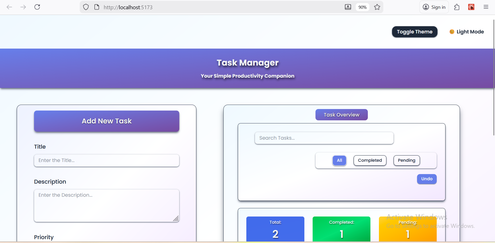
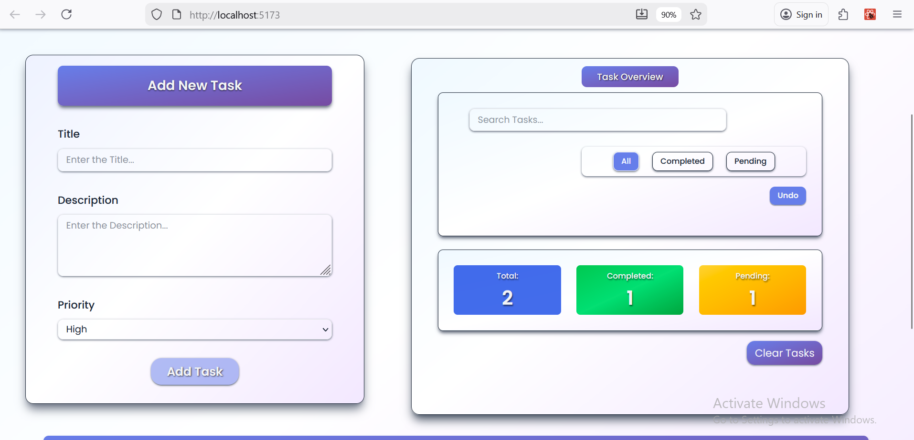
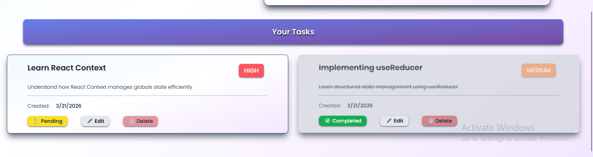
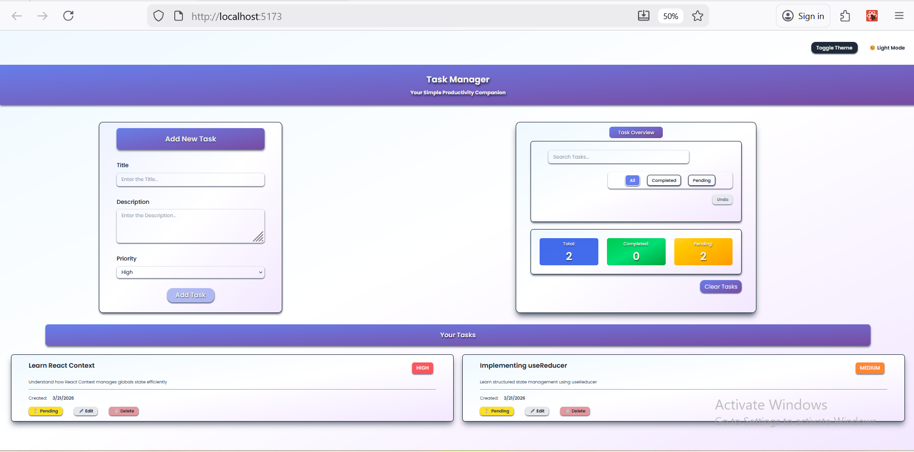
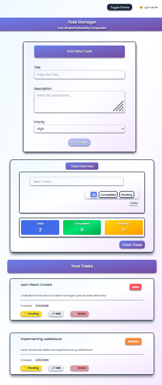
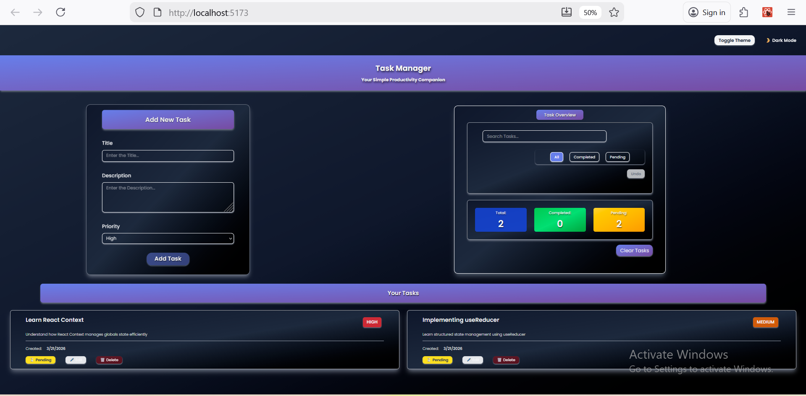
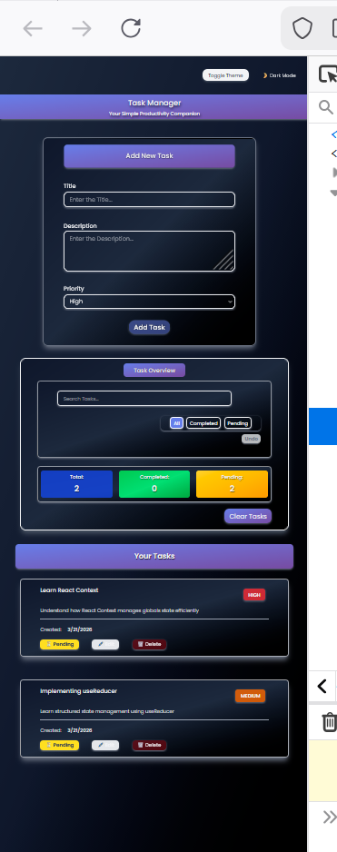

# Assignment -2

## Task Management App
[Open Task Management App](./task-management)

### Netlify Deployment Link
   https://task-management-assignmnt.netlify.app/

### Images of app 
[Go to images](#images)

A responsive task management app built with React, Context API, useReducer and have the basic CRUD Functionality.

### Features
#### Core Functionality
- Add new task (title, description, priority)
- Edit Task
- Delete Task
- Toggle Task Status (completed, pending)
- Clear all Task
- Undo Last 10 actions
- Search tasks by title and description
- Filter tasks: (all, completed, pending)
- Task Stats

```
assignment-2/
└─ task-management/
   ├─ public/
   └─ src/
      ├─ assets/
      ├─ components/
      │  ├─ Pages/
      │  └─ Theme/
      └─ context/
```

### How it all comes Together

#### Task Features (Add, Edit, Delete, Toggle Status, Undo)
The React Context API
Task starts with a initial state mentioned in the TaskContext.jsx
Then taskReducer is responsible for updating state based on what we dispatch.
In the reducer we save the history of the last 10 actions to perform undo functionality

Logic happens based on the type of actions in the reducer, 
-> like to addTask, you create the task based on the dispatch(taskData) and then save it to history using the helper function created for undo functionality and add the newTask in the new array containing the old ones also using the spread operator

-> to delete task, dispatch the taskId, match the task.id(state) to the taskId(dispatch) and filter the id (keep the state with the history helper)

-> to update/edit task, dispatch (id, updates), match the ids(state,dispatch) and then add the updates in the tasks that are mapped, destructre the matched id task and update it(using useState in the TaskItem.jsx based on what you are updating and the editTask reducer)(saveHistory)

-> to toggle task, match the ids(state,dispatch) and the toggle the task.completed with the previous state(if true => false and vice versa), will map the task and ...spread task, and finally toggle (saveHistory)

-> for filtering mentioned in the initial state, it's default is to show all task. When filtering the task => if task.completed, change state to 'completed' otherwise 'pending'

-> for search functionality, see if it includes the searchTerm that the user inputs and if it matches render the filtered task

-> for clear all task, when the button with this functionality is clicked it make the the task array created in the initial state and then the what user add to empty task array [](all tasks are deleted but undo functionality can undo the last 10 state saved)

-> for undo, check if the history (in initial state empty or not), if it is not save the currentState and the last 10 state(from the saveHistory helper function) to the state and return it to history and then action type is dispatched to get the last 10 actions

### UI
Basic design with form and the task overview in a grid (for smaller device will grid-cols-1) and the task in the bottom displayed in grid of 2 and for smaller device grid of 1
Theme with linear background gradinents for both light and dark theme
Framer motion for basic animation like on start of the application the form appears to be coming up from the slightly lower position

### Images 

NOTE:- whole app image screenshot is taken with 50% pc screen width may not be clear and the responsive in 30%









